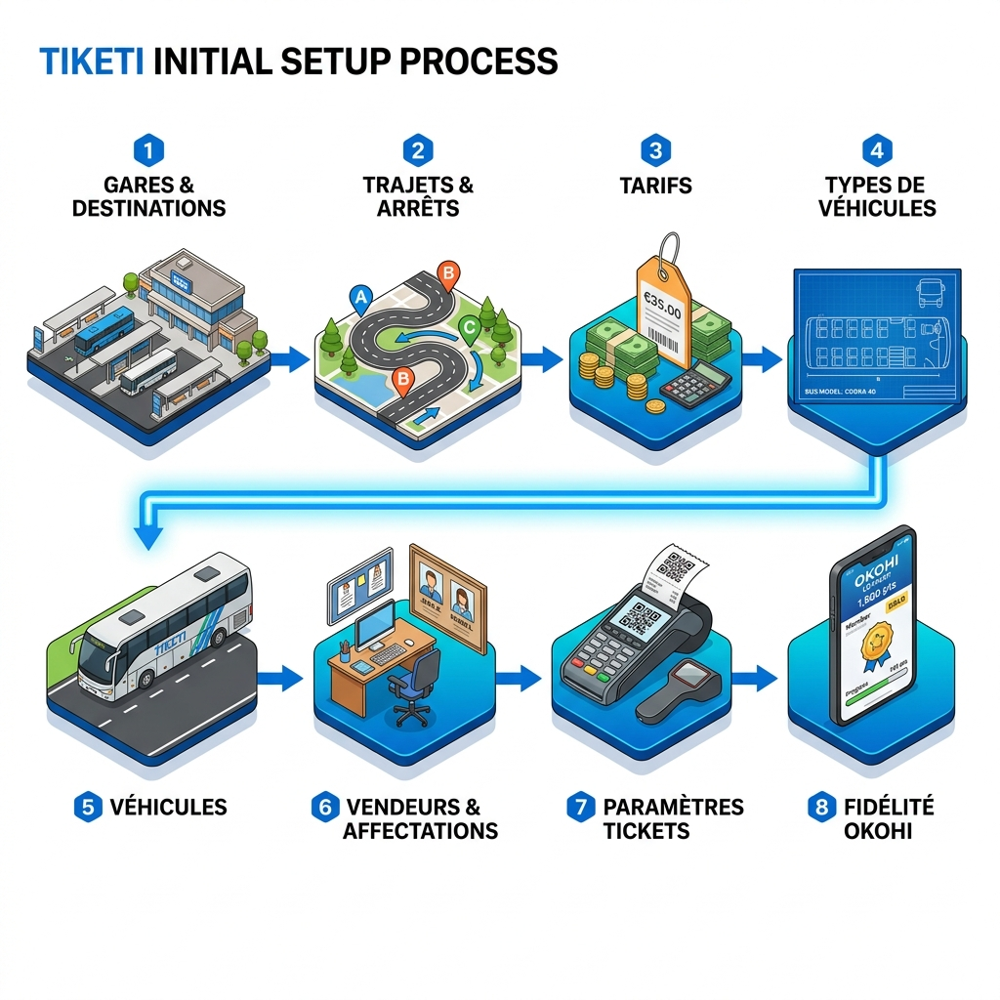
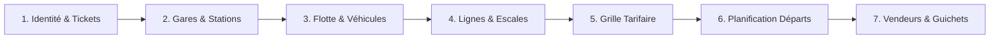

# 🚌 Guide d'Utilisation TIKETI — Pour les Compagnies

Bienvenue sur **TIKETI**, la plateforme tout-en-un pour la gestion de votre billetterie et de votre flotte de transport. Ce guide vous accompagne pas à pas dans le paramétrage initial de votre espace pour commencer à vendre vos billets en quelques minutes.

---

## 📋 Sommaire

1. [Introduction](#introduction)
2. [Étape 1 : Identité & Paramètres Ticket](#étape-1--identité--paramètres-ticket)
3. [Étape 2 : Gestion des Gares (Stations)](#étape-2--gestion-des-gares-stations)
4. [Étape 3 : Flotte (Types de Véhicules & Véhicules)](#étape-3--flotte-types-de-véhicules--véhicules)
5. [Étape 4 : Configuration des Lignes (Routes)](#étape-4--configuration-des-lignes-routes)
6. [Étape 5 : Grille Tarifaire](#étape-5--grille-tarifaire)
7. [Étape 6 : Planification des Voyages (Départs)](#étape-6--planification-des-voyages-départs)
8. [Étape 7 : Gestion du Personnel](#étape-7--gestion-du-personnel)
9. [Prêt pour la Vente !](#prêt-pour-la-vente-)

---

## Introduction

En tant qu'administrateur de votre compagnie sur TIKETI, vous avez le contrôle total sur votre infrastructure numérique. Votre espace est isolé et sécurisé. Avant d'ouvrir votre premier guichet, vous devez configurer les éléments structurels de votre activité dans l'ordre préconisé ci-dessous.

---

## Étape 1 : Identité & Paramètres Ticket
*Menu : Paramètres > Paramètres Ticket*

C'est ici que vous définissez ce qui apparaîtra sur les reçus de vos clients :
- **Nom de l'entreprise** : Ex: "TEST TRANSPORT".
- **Coordonnées** : Vos numéros de téléphone pour le service client.
- **Messages** : Informations légales ou promotionnelles en bas de ticket (ex: "Bon voyage", "Non remboursable").
- **QR Code** : Activez l'impression du QR Code pour permettre aux superviseurs de valider les billets via l'application mobile.

---

## Étape 2 : Gestion des Gares (Stations)
*Menu : Infrastructure > Gares*

Enregistrez toutes les gares de votre réseau :
- **Nom & Code** : Ex: Abidjan (ABJ), Yamoussoukro (YAM).
- **Ville** : Pour faciliter la recherche.
- **Position GPS** : Essentiel pour le suivi en temps réel et les applications chauffeurs.

Dans la fiche détaillée d'une gare, les boutons **+** des accordéons ouvrent un formulaire contextuel sans quitter la page. Ils permettent de créer un trajet ou un programme de départ, d'affecter un vendeur et d'ajouter un véhicule au pool de la gare sélectionnée. Après validation, les données de la fiche sont actualisées en conservant la position de travail.

L'accordéon **Pool actuel en gare - Cars disponibles** présente les véhicules actuellement localisés dans la gare sélectionnée, avec leur statut opérationnel et l'indication de leur gare d'attache ou de leur arrivée par voyage.

Lorsqu'une affectation de véhicule chevauche une affectation existante, le formulaire reste ouvert. Une alerte indique la gare dont le pool contient déjà le véhicule et la période concernée, afin que l'utilisateur puisse corriger son choix sans perdre le contexte.

Les compteurs du menu **Paramètres** respectent le périmètre du compte connecté. Un vendeur voit uniquement les totaux de ses gares accessibles, un superviseur ceux de son périmètre supervisé, et un administrateur les totaux globaux de l'entreprise. Les badges du menu et les cartes de la page d'accueil utilisent les mêmes règles de calcul.

Le formulaire d'un programme de départ est identique depuis la fiche d'une gare et depuis le menu **Programmes de départ**. Sa grille compacte présente toutes les informations dans une seule vue, sans cartes internes ni défilement sur écran de bureau. Le choix du type de véhicule renseigne automatiquement la capacité prévisionnelle à partir du nombre de places du type ; cette valeur reste modifiable avant l'enregistrement.

La gare propriétaire et la gare d'origine étant nécessairement identiques pour un programme, elles sont présentées sous un seul champ **Gare de départ**. Le fuseau horaire n'est pas exposé dans ce formulaire et conserve la valeur configurée par défaut. Le **Quota de billets prioritaires**, **Autoriser les correspondances** et **Affectation automatique des correspondances** restent configurables directement dans le programme de départ.

Lors de la création d'un programme, les correspondances sont autorisées et le contrôle des ventes est fermé par défaut. L'ouverture des ventes reste une action explicite de l'exploitant.

Dans les listes de programmes de départ, l'itinéraire affiché reprend les noms des gares de départ et de destination sélectionnées dans le programme, et non les seules villes du trajet général.

Dans le menu **Programmes de départ**, chaque gare regroupe ses propres programmes. La colonne **Destination** affiche donc directement la gare d'arrivée. Les dates de validité restent consultables et modifiables dans le formulaire du programme.

La liste de ce menu n'affiche que les gares possédant au moins un programme de départ. Les gares ayant le plus de programmes apparaissent en premier et tous les accordéons sont fermés par défaut pour garder une vue compacte.

Le badge du menu **Programmes de départ** indique le nombre total de programmes enregistrés et reste synchronisé après une création ou une suppression.

Le badge **Pools véhicules / gare** indique le nombre de véhicules dont l'affectation à une gare est active à la date du jour.

Lors de la modification d'un programme, ses dates de validité sont rechargées dans les sélecteurs. Le programme en cours est exclu du contrôle des doublons : conserver son trajet, son horaire et sa période ne bloque donc pas l'enregistrement.

La carte globale du réseau est affichée à l'ouverture de **Gares / Destinations**, avant la sélection d'une gare. Une fois une gare choisie, elle laisse place à une fiche compacte présentant Ville, Code et Quartier sur une même ligne, suivis de l'adresse et des accordéons opérationnels.

Dans la liste des gares, le nom complet reste toujours visible et revient à la ligne si nécessaire ; les badges d'état, le code et les compteurs sont présentés séparément en dessous.

---

## Étape 3 : Flotte (Types de Véhicules & Véhicules)
*Menu : Flotte > Types & Véhicules*

La gestion de la flotte se fait en deux temps :
1. **Types de Véhicules** : Définissez vos modèles (Minibus 15 places, Bus 50 places, etc.). Configurez la disposition des sièges (2+2, 1+2) pour que le plan de salle interactif soit correct lors de la vente.
2. **Véhicules** : Enregistrez vos bus physiques avec leur immatriculation (ID) et affectez-les à un type créé précédemment.

Lorsqu'un voyage n'a pas encore de véhicule, un vendeur affecté à sa gare de départ peut ouvrir **Choisir dans le pool** depuis la billetterie. Un vendeur d'une escale intermédiaire peut consulter le voyage et vendre selon les règles en vigueur, mais il ne peut ni consulter le pool de départ ni assigner le véhicule. Les superviseurs et administrateurs autorisés conservent cette possibilité. Si aucun véhicule n'est affecté à la gare de départ pour la date du voyage, l'interface affiche un état vide et invite un administrateur ou un gestionnaire de flotte à effectuer l'affectation ; aucun plan de sièges n'est chargé tant qu'un véhicule n'a pas été assigné.

---

## Étape 4 : Configuration des Lignes (Routes)
*Menu : Réseau > Lignes*

Une ligne définit un itinéraire. 
- **Départ & Destination** : Les gares extrêmes de la ligne.
- **Escales** : Ajoutez toutes les gares intermédiaires dans l'ordre exact de passage. TIKETI calculera automatiquement les segments de voyage possibles.

---

## Étape 5 : Grille Tarifaire
*Menu : Réseau > Tarification*

Définissez le prix du transport entre chaque gare d'une ligne.
- TIKETI vous permet de saisir les prix pour chaque combinaison (ex: Abidjan → Yamoussoukro, Yamoussoukro → Bouaké).
- Assurez-vous que tous les segments sont tarifés pour que les vendeurs puissent émettre des billets à n'importe quelle escale.

---

## Étape 6 : Planification des Voyages (Départs)
*Menu : Opérations > Voyages*

C'est l'étape où vous créez les départs concrets :
1. Choisissez la **Ligne**.
2. Choisissez le **Véhicule** affecté à ce départ.
3. Définissez l'**Heure de départ**.
4. **Mode de Réservation** :
   - **Placement attribué** : Le client choisit son siège sur le plan (recommandé pour les longs trajets).
   - **Placement libre** : Vente simplifiée sans numéro de siège imposé.

---

## Étape 7 : Gestion du Personnel
*Menu : Utilisateurs*

Créez les accès pour vos collaborateurs :
- **Administrateur** : Accès total aux paramètres.
- **Gérant de Gare** : Gestion des départs d'une gare spécifique.
- **Vendeur (Guichetier)** : Interface de vente rapide. Affectez chaque vendeur à sa gare de travail.
- **Superviseur** : Contrôle des départs et scan des tickets.

---

## Prêt pour la Vente !

Une fois ces étapes validées, vos vendeurs peuvent se connecter sur leur interface dédiée. Ils verront apparaître les voyages programmés et pourront commencer à émettre des tickets avec impression thermique ou Bluetooth instantanée.

---

> [!TIP]
> **Besoin d'aide ?** Votre tableau de bord affiche des statistiques en temps réel sur vos ventes et le taux de remplissage de vos bus pour vous aider à optimiser votre exploitation.
